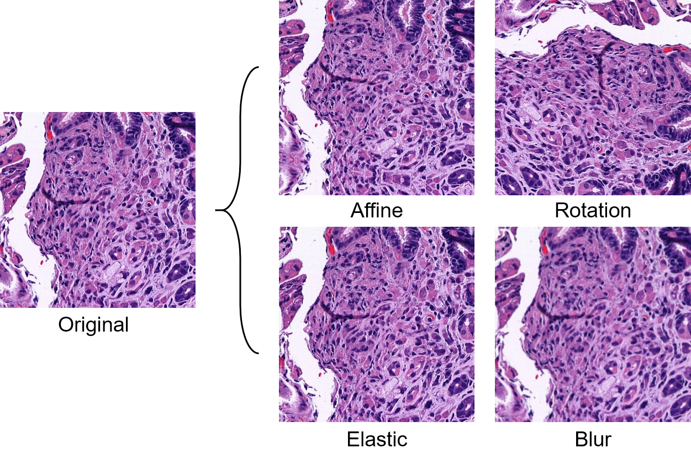
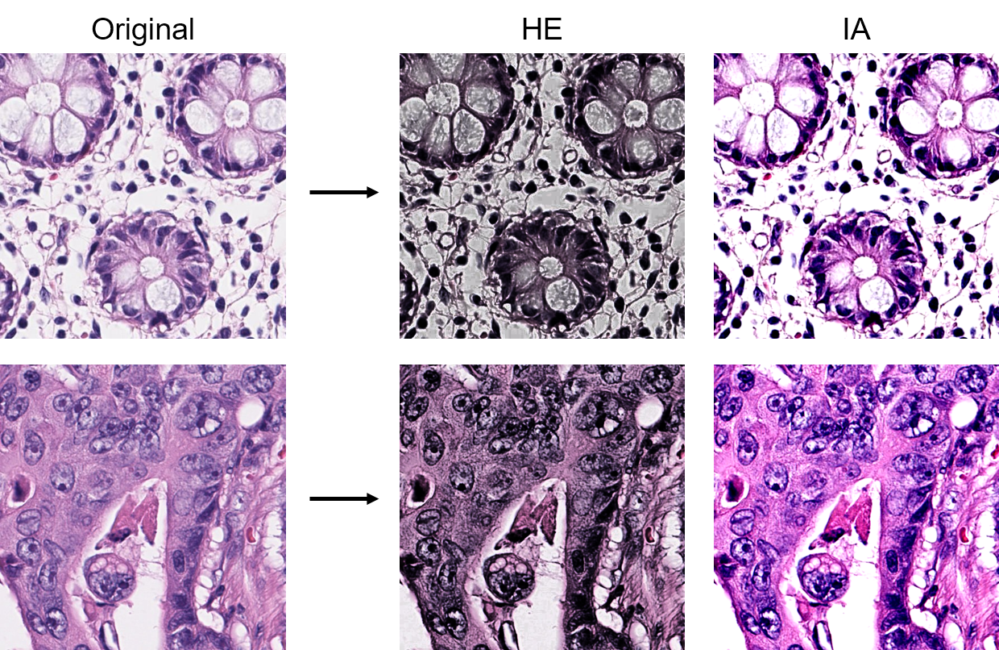
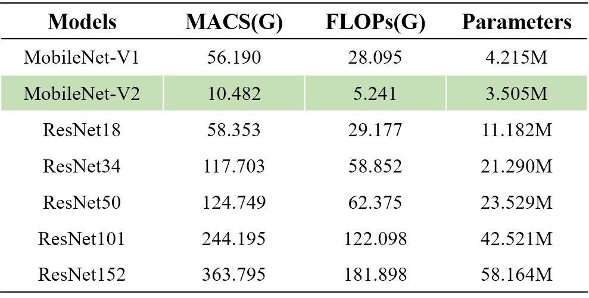

# NPHD
 
## National Pathology Health Datathon 2021 대회 참가
- 과학기술정보통신부 주관, 한국지능정보사회진흥원 지원

### 소화기 병리 이미지에 대해 암조직과 암이 아닌 조직을 효율적으로 분류하는 딥러닝 모델 개발

- 다양한 데이터 증강 기법을 활용하여 모델의 강건성과 일반화 성능을 높임

- `thop` 패키지를 활용하여 후보 모델들의 연산량 및 파라미터 수 계산

